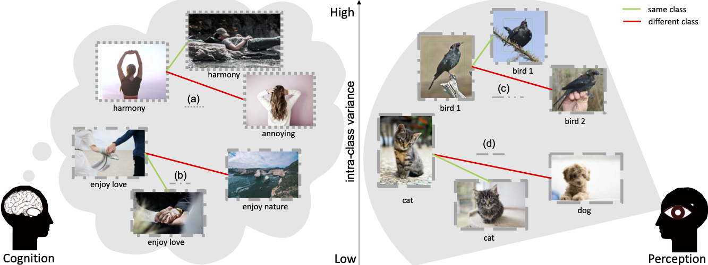

# Intentonomy: a Dataset and Study towards Human Intent Understanding

Project page for the paper:

[*Intentonomy: a Dataset and Study towards Human Intent Understanding*](https://arxiv.org/abs/2011.05558) **CVPR 2021** (**oral**)




## 1️⃣ Intentonomy Dataset


### Download 

we introduce a human intent dataset, Intentonomy, containing 14K images that are manually annotated with 28 intent categories, organized in a hierarchy by psychology experts. See [DATA.md](https://github.com/KMnP/intentonomy/blob/master/DATA.md) for how to download the dataset.

### Annotation Demo

We employed a "game with a purpose" approach to acquire the intent annotation from Amazon Mechanical Turks. See [this link](https://kmnp.github.io/intent_demo/) for furthur demonstration. See Appendix C in our paper for details.


## 2️⃣ From Image Content to Human Intent

To investigate the intangible and subtle connection between visual content and intent, we present a systematic study to evaluate how the performance of intent recognition changes as a a function of (a) the amount of object/context information; (b) the properties of object/context, including geometry, resolution and texture. Our study suggests that:

1. different intent categories rely on different sets of objects and scenes for recognition; 
2. however, for some classes that we observed to have large intra-class variations, visual content provides negligible boost to the performance. 
3. our study also reveals that attending to relevant object and scene classes brings beneficial effects for recognizing intent.

## 3️⃣ Intent Recognition Baseline

We introduce a framework with the help of weaklysupervised localization and an auxiliary hashtag modality that is able to narrow the gap between human and machine understanding of images. We provide the results of the our baseline model below. 

### Localization loss implementation

We provide the implementation of the proposed localization loss in `loc_loss.py`, where the default parameters are the one we used in the paper. Download the masks for our images (518M) [here](https://cornell.box.com/s/dp53z6iofaa8zzg1tg04tmipob8h57v7) and update the `MASK_ROOT` in the script.

Note that you will need `cv2` and `pycocotools` libraries to use `Localizationloss`. Other notes are included in the `loc_loss.py`.

### Identifying intent classes

We break down the intent classes into different subsets based on:

1. **content dependency**: i.e., object-dependent (O-classes), context-dependent (C-classes), and Others which depends on both foreground and background information; 
2. **difficulty**: it measures how much the VISUAL outperforms achieves than the RANDOM results (“easy”, “medium” and “hard”). 

See Appendix A in our paper for details.

scp menglin@10.100.115.133:/checkpoints/menglin/h2/checkpoint/menglin/projects/2020intent/coco_maskrcnn.json coco_maskrcnn.json

### Baseline results

Validation set results:

|                         | Macro F1         | Micro F1         | Samples F1       |
| ----------------------- | ---------------- | ---------------- | ---------------- |
| VISUAL                  | 23.03 $\pm$ 0.79 | 31.36 $\pm$ 1.16 | 29.91 $\pm$ 1.73 |
| VISUAL + $L_{loc}$      | 24.42 $\pm$ 0.95 | 32.87 $\pm$ 1.13 | 32.46 $\pm$ 1.18 |
| VISUAL + $L_{loc}$ + HT | 25.07 $\pm$ 0.52 | 32.94 $\pm$ 1.16 | 33.61 $\pm$ 0.92 |

Test set results:

|                         | Macro F1         | Micro F1         | Samples F1       |
| ----------------------- | ---------------- | ---------------- | ---------------- |
| VISUAL                  | 22.77 $\pm$ 0.59 | 30.23 $\pm$ 0.73 | 28.45 $\pm$ 1.71 |
| VISUAL + $L_{loc}$      | 24.37 $\pm$ 0.65 | 32.07 $\pm$ 0.84 | 30.91 $\pm$ 1.27 |
| VISUAL + $L_{loc}$ + HT | 23.98 $\pm$ 0.85 | 31.28 $\pm$ 0.36 | 31.39 $\pm$ 0.78 |


### Subsets results on validation set

By content dependency:

|                         | object           | context          | other            |
| ----------------------- | ---------------- | ---------------- | ---------------- |
| VISUAL                  | 25.58 $\pm$ 2.51 | 30.16 $\pm$ 2.97 | 21.34 $\pm$ 0.74 |
| VISUAL + $L_{loc}$      | 28.15 $\pm$ 1.94 | 28.62 $\pm$ 2.13 | 22.60 $\pm$ 1.40 |
| VISUAL + $L_{loc}$ + HT | 29.66 $\pm$ 2.19 | 32.48 $\pm$ 1.34 | 22.61 $\pm$ 0.48 |

By difficulty:

|                         | easy             | medium           | hard             |
| ----------------------- | ---------------- | ---------------- | ---------------- |
| VISUAL                  | 54.64 $\pm$ 2.54 | 24.92 $\pm$ 1.18 | 10.71 $\pm$ 1.33 |
| VISUAL + $L_{loc}$      | 57.10 $\pm$ 1.84 | 25.68 $\pm$ 1.24 | 12.72 $\pm$ 2.31 |
| VISUAL + $L_{loc}$ + HT | 58.86 $\pm$ 2.56 | 26.30 $\pm$ 1.42 | 13.11 $\pm$ 2.15 |


## Citation

If you find our work helpful in your research, please cite it as:

```tex
@inproceedings{jia2021intentonomy,
  title={Intentonomy: a Dataset and Study towards Human Intent Understanding},
  author={Jia, Menglin and Wu, Zuxuan and Reiter, Austin and Cardie, Claire and Belongie, Serge and Lim, Ser-Nam},
  booktitle={CVPR},
  year={2021}
}
```


## Acknowledgement

We thank Luke Chesser and Timothy Carbone from Unsplash for providing the images, Kimberly Wilber and Bor-chun Chen for tips and suggestions about the annotation interface and annotator management, Kevin Musgrave for the general discussion, and anonymous reviewers for their valuable feedback.
